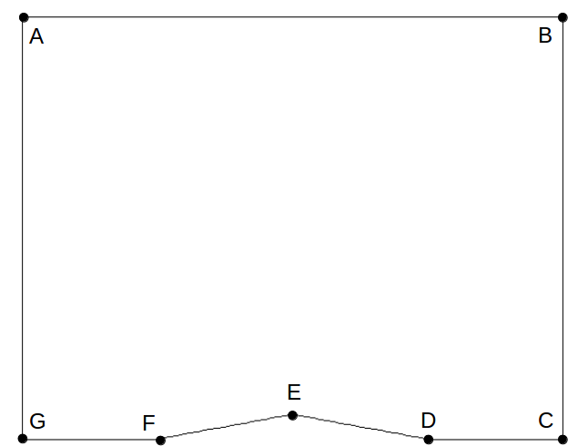

Project description
===================

Given task
----------

In this project, 2-D explicit Navier-Stokes solver (Hereafter called 2DNS code) has been developed. The 2DNS code was verified in this project by applying supersonic flow over a 10 deg. diamond airfoil. The test cases were employed in terms of inviscid and viscous conditions.

Governing Equations
-------------------

Here, the 2-D, unsteady Navier-Stokes equations will be solved. The equations will be marched forward in time until a steady state solution is achieved. The transformed conservative form of 2-D Navier-Stokes equations can be written:

.. math::
   \frac{\partial \left ( \bar{U} / J \right )}{\partial t} + \frac{\partial \vec{F'}}{\partial \xi} + \frac{\partial \vec{G'}}{\partial \eta} = 0

where the transformed state and inviscid flux vectors are

.. math::
   \vec{U} = \begin{bmatrix} \rho\\ \rho u\\ \rho v\\ E_{t} \end{bmatrix}

and transformed flux vector can be represented by:

.. math::
   \vec{F'} = \frac{1}{J} \left [ \xi_{x} (\vec{F}_{I} - \vec{F}_{V}) + \xi_{y} (\vec{G}_{I} - \vec{G}_{V}) \right ],\;\;\;\; \vec{G'} = \frac{1}{J} \left [ \eta_{x} (\vec{F}_{I} - \vec{F}_{V}) + \eta_{y} (\vec{G}_{I} - \vec{G}_{V}) \right ]

Here :math:`\vec{F}_{I}` and :math:`\vec{F}_{V}` indicate the inviscid and viscous flux terms in x-direction, respectively. The same notation is employed to flux vector :math:`\vec{G}`. The total energy per unit volume and stagnation enthalpy per unit mass are defined by followings:

.. math::
   E_{t} = \frac{p}{\gamma - 1} + \frac{\rho}{2} \left ( u^{2} + v^{2} \right )

.. math::
   h_{0} = \frac{p \gamma}{\rho (\gamma - 1)} + \frac{1}{2} \left ( u^{2} + v^{2} \right )

Detailed process for solving the Navier-Stokes equations will be repeated in the following sections.

Computational Domain
--------------------

This project analyze the top half of a 10 deg. diamond airfoil so the location of point E is (x,y) = (0.5, 0.0882). Each grid point can be describd by (x,y) location or (:math:`i`, :math:`j`) location where the :math:`i` index is in the :math:`\xi` direction and the :math:`j` index is in the :math:`\eta` direction. The grid will consist of 65 points in the ":math:`i`" direction and 57 points in the ":math:`j`" direction. The inverse grid metrics must be evaluated at every grid point in the computational domain (including the boundaries). Use 2nd order accurate, central differences for interior points and 2nd order accurate, one-sided differences for boundary points. After the inverse metrics are computed, the grid Jacobian and grid metrics must be computed and stored at every location (including the boundaries)

