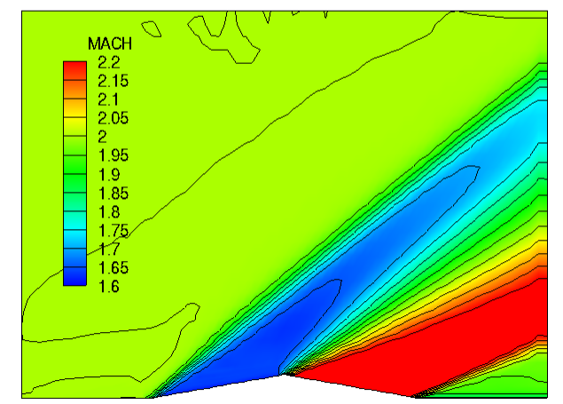
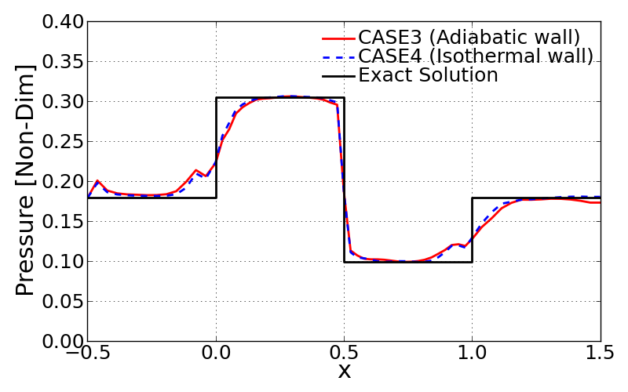
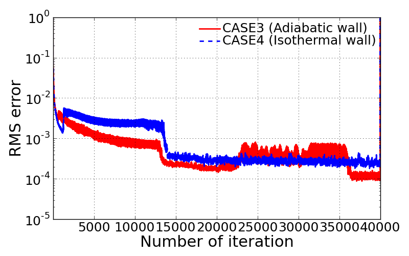

Results and discussions
=======================

Computational Grid
------------------

The grid used in this project has a resolution of 65 X 57 in i- and j-directions as shown below. In this project, unsteady 2-dimensional Navier-Stokes solution is being resolved by performing the explicit time-integration.

.. image:: ./images/mesh.png
   :width: 60%

<Computational grid>

Inviscid solution (CASE 1 & CASE 2)
-----------------------------------

Following cases were achieved by running the 2DNS code with inviscid option off. The solution was obtained by running 40,000 iterations.

**CASE 1**

- Inviscid solution
- 1st order accuracy (CFL = 0.5)

For the first order accurate solution, central differencing was applied to solve the inviscid flux terms with AUSMPW+ scheme and to resolve the first derivatives in shear stress and heat flux terms. The following figure represents the fully developed shock waves across the airfoil in terms of local Mach number.

.. image:: ./images/Mach_CASE1.png
   :width: 60%

<Contour plot of Mach number: CASE 1>

**CASE 2**

- 2nd order accurate (CFL = 0.5)
- with basic minmod limiter

For the second approach to resolve the inviscid solution, the fully upwind scheme for extrapolation was employed based on the characteristics wave direction. Then the basic minmod limiter was turned on to get TVD(Total Variation Diminishing) solution.

<Contour plot of Mach number: CASE 2>

.. image:: ./images/Pressure_CASE1and2.png
   :width: 60%

<Comparison of static pressure along the bottom wall boundary>

.. image:: ./images/RMSlog_CASE1and2.png
   :width: 60%

<Comparison of RMS error log>

Viscous flow solution (CASE 3 & CASE 4)
---------------------------------------

Following cases were achieved by running the 2DNS code with inviscid option on. The solution was obtained by running 40,000 iterations.

**CASE 3**

- Navier-Storkes solution
- 2nd order accurate (CFL = 0.5)
- with basic minmod limiter
- Adiabatic wall BC

.. image:: ./images/Mach_CASE3.png
   :width: 60%

<Contour plot of Mach number: CASE 3>

**CASE 4**

- Navier-Storkes solution
- 2nd order accurate (CFL = 0.5)
- with basic minmod limiter
- Isothermal wall BC (:math:`T_{wall}` = 300 k)

.. image:: ./images/Mach_CASE4.png
   :width: 60%

<Contour plot of Mach number: CASE 4>

<Comparison of static pressure along the bottom wall boundary>

<Comparison of RMS error log>
